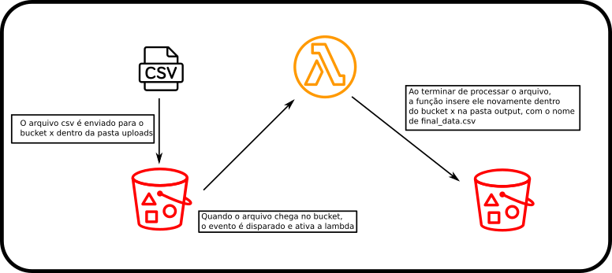

# 🧐 1. OBJETIVO

Estudar mais a fundo uma maneira de utilizar uma aplicação serverless construída em python, com o localstack e o serverless framework, sendo que essa aplicação rodaria na aws.

A aplicação em sí é uma função lambda que ativa com um evento de inserção de arquivo no em um bucket do s3, processa esse arquivo e devolve para o mesmo bucket em outra pasta, sendo que o arquivo em questão é um csv.

Ou seja, cai um csv em uma dada pasta do bucket, a lambda é ativada, abre o csv, processa e devolve o mesmo.

## 1.1 O CSV DE INPUT

O arquivo que usarei como teste se encontra [aqui]('./read_from_s3/read_from_s3/test/utils/files/class.csv') e a tabela abaixo mostra como ele deve ser;

|NAME|POINTS|
|-|-|
|a|10|
|b|8|
|c|7|

## 1.2 O CSV DE INPUT

O novo csv será idêntico ao de input, com a adição de uma linha, sendo que essa linha é a média dentre os valores das demais.

|NAME|POINTS|
|-|-|
|a|10|
|b|8|
|c|7|
|MEAN|8.333333333333334|

Esse valor será calculado pela biblioteca do Pandas. Não existe real motivo em utilizar essa lib considerando um conjunto de dados tão pequeno, não teria perda nenhuma de performance caso utilizasse a lib 'csv' já existente no python, assim evitando pesar a sua função lambda. Mas o meu objetivo aqui era justamente fazer um teste com utilização de dependências, pois assim eu conseguiria saber exatamente o que fazer quando precisar.

## 1.3 ESQUEMA DE FUNCIONAMENTO
<h1 align="center">
    
</h1>

# 📑 2. COMO USAR

## 2.1 INSTALAÇÕES

### 2.1.1 PYTHON E AFINS
- Python: Para instalar o python vá até a [python.org](https://www.python.org/) e siga as instruções, mas se for usuário linux o python já está instalado.

- Poetry: O [poetry](https://python-poetry.org/) é um gerenciador de pacotes do python, que ajuda bastante, mas é opcional. Para instalá-lo:
    ```sh
    $ pip install --user poetry
    ```

- Venv: Recomendo utilizar um ambiente virtual, mas é opcional
    ```sh
    $ sudo apt-get install python3-venv
    ```

- Pandas: É bom instalar o pandas na sua máquina local pois assim você poderá rodar os testes.
    - se tiver o poetry:
    ```sh
    $ poetry install
    ```
    - se não:
    ```sh
    $ pip install pandas
    $ pip install boto3
    $ pip install pytest
    $ pip install pytest-cov
    ```

### 2.1.2 DOCKER

Para rodar o localstack você vai precisar do docker instalado, se você utiliza windows ou mac, então veja os passos na documentação [aqui](https://docs.docker.com/get-docker/). Mas se utiliza linux, então rode os comandos abaixo (se não utiliza o apt como instalador, então troque para o seu onde chamo o apt).

```sh
$ sudo apt install docker.io
$ sudo curl -L "https://github.com/docker/compose/releases/download/1.26.2/docker-compose-$(uname -s)-$(uname -m)" -o /usr/local/bin/docker-compose
$ sudo chmod +x /usr/local/bin/docker-compose
$ sudo groupadd docker
$ sudo usermod -aG docker $USER
$ su $USER
```

### 2.1.3 SERVERLESS FRAMWORK

Você pode olhar na documentação do mesmo [aqui](https://www.serverless.com/framework/docs/getting-started/) pois tem como instalar via curl, mas eu escolhi instalar via npm, e pra isso precisaremos de instalar o node, e pra isso basta ir na página do node e seguir a instalação [aqui](https://nodejs.org/en/).

Então depois você pode digitar no terminal:

```sh
$ npm install -g serverless
```

E agora instale o plugin do serverless-localstack para que o framework aponte para dentro do container do localstack

```sh
$ serverless plugin install --name serverless-localstack
```

### 2.1.4 AWS CLI

Caso queira subir o projeto para a aws, você deve instalar a cli da aws, o que é bem simples, basta entrar [aqui](https://aws.amazon.com/cli/) escolher seu sistema e seguir as instruções. Depois configure a cli com o comando `$ aws configure` e pronto. Mas se não quiser subir o projeto e manter ele somente no localstack, então não precisa instalar.

### ⚠️ IMPORTANTE

Caso queira subir para a aws então troque o nome do bucket no arquivo `read_from_s3/src/serverless.yml` na linha 5, pois a aws não permite dois buckets com o mesmo nome, e esse eu já criei.

```yaml
custom:
  bucketName: muly-dev
```

E também, troque o bucket dentro do arquivo `read_from_s3/test/utils/files/event.json` nas linhas 23 e 27.

```json
"bucket": {
    "name": "muly-dev",
    "ownerIdentity": {
    "principalId": "EXAMPLE"
    },
    "arn": "arn:aws:s3:::muly-dev"
},
```

## 2.2 COMO RODAR

### 2.2.1 LOCAL

Com tudo isso instalado você pode agora rodar os comando na seguinte ordem (sendo que seu terminal deve estar para dentro da pasta raiz do projeto, ou seja, no mesmo nivel que o docker-compose.yml):

- Se tiver o poetry

```sh
$ docker-compose up
$ poetry run sls_deploy
$ pytest
```

- Se não tiver:
```sh
$ docker-compose up
$ python scripts.py
$ pytest
```

A lib pytest faz com que todos os nossos testes rodem, e em um dos testes um arquivo é enviado para o bucket que está dentro do localstack. Então os testes estão cobrindo as unidades de códigos (unit tests) e todo o processo (integration).

### 2.2.2 NA AWS

Para mandar para a aws esse projeto, você tem que ter configurado a cli seguindo os passos da documentação da mesma (inclusive criando o usuário em IAM). Feito isso, você vai precisar somente de comentar a linha com o plugin do localstack que o serverless utiliza para apontar para o container. Para isso vá no arquivo `read_from_s3/src/serverless.yml` e comente as linhas 28 e 29. E então rode o comando:

```sh
$ poetry run sls_deploy
# ou se não tiver o poetry
$ python scripts.py
```

# 🤿 3. INDO MAIS A FUNDO

Se quiser entender melhor a estrutura de pastas, o como o arquivo serverless.yml funciona, o que é o localstack, o porque do arquivo scritps.py, o processo de instalação de dependências na lambda e como fiz os testes, então continue lendo. Mas se não quiser saber disso e só queria por para rodar, então pode parar por aqui mesmo, e muito obrigado pela atenção.

## 3.1 ESTRUTURA
Abaixo a gente consegue ver a estrutura de pastas que montei.

```sh
.
├── docker-compose.yml
├── poetry.lock
├── pyproject.toml
├── read_from_s3
│   ├── __init__.py
│   ├── src
│   │   ├── handler.py
│   │   └── serverless.yml
│   └── test
│       ├── integration
│       │   └── localstack_test.py
│       ├── unit
│       │   └── handler_test.py
│       └── utils
│           ├── files
│           │   ├── class.csv
│           │   └── event.json
│           └── mock
│               └── Client.py
├── README.md
├── requirements.txt
├── scripts.py
└── view_logs.py
```

A minha ideia com essa estrutura foi primeiramente separar os arquivos de configuração do projeto, por isso que os arquivos de `requirements.txt`, `scripts.py`, `view_logs.py`, `docker-compose.ym`l, `poetry.lock` e `pyproject.toml` estão na raiz e o projeto em si está dentro de `read_from_s3`. Esse estilo de repetir o nome do projeto em uma pasta interna é algo bem comum na comunidade python, e achei legal de organizar assim. 


O segundo objetivo era separar tudo que era de testes do que era código. Por isso das pastas `src` e `test`, mas como o python precisa que algo seja um pacote para ser importável em outro arquivo eu preciso criar o arquivo `__init__.py` dentro da pasta `read_from_s3`, assim eu consigo importar o arquivo `handler.py` (que é a função serverless propriamente dita) dentro dos arquivos de teste.


Agora indo para dentro da pasta `src`, eu tenho a função serverless e o arquivo `serverless.yml` juntos, assim as coisas que são relativas a função lambda ficam juntos, e quando crio essa função na aws a minha raiz vai mostrar somente o `handler.py` sem toda essa estrutura de pastas, assim fica mais organizado lá na aws. Pois se eu colocasse o `serverless.yml` em outro lugar eu teria que referenciar todo o caminho até o `handler.py` e na aws teríamos todo esse caminho construído também.


Já na pasta de `test`, eu preferi criar subpastas que me auxiliaram a não deixar os arquivos todos soltos e desorganizados. Para isso eu criei a pasta `integration` para os testes de integração (que envia o arquivo para o localstack e verifica se todo o processo ocorreu normalmente), a pasta `unit` que tem os testes unitários, que testem cada função do arquivo `handler.py` de forma individual. E a pasta `utils` que ficariam os meus arquivos de testes e funções de mock (vou explicar isso na parte de testes).


Dentro de `files` eu deixei o `class.csv` que será utilizado durante todos os testes, e também o arquivo `event.json`, que também é utilizado durante os testes para verificar se a função interpreta o evento corretamente. Esse arquivo é identico ao que é gerado durante um evento na aws, eu criei ele através do SAM-CLI da aws, você pode ver [aqui](https://docs.aws.amazon.com/serverless-application-model/latest/developerguide/serverless-sam-cli-install.html) como instalá-lo e utilizar o mesmo, ele cumpre a mesma função do serverless framework, mas eu preferi trabalhar com o serverless (achei mais simples, e mais bem documentado e com a comunidade maior, assim facilita as pesquisas por dúvidas). E de dentro do SAM eu utilizei o método [generate-event](https://docs.aws.amazon.com/serverless-application-model/latest/developerguide/sam-cli-command-reference-sam-local-generate-event.html) para criar esse arquivo de evento. 


> OBS.: Se quiser instalar o SAM eu recomendo fazer isso via pip e não via homebrew como descreve na documentação, pois para mim não deu certo, para isso veja [aqui](https://pypi.org/project/aws-sam-cli/) no pypi.


> OBS.: Eu não sei se o serverless gera um evento também, por isso utilizei o sam, se souber como fazer isso dentro do próprio serverless me fale em uma issue por favor, pois iria simplificar ao utilizar somente um framework.


## 3.2 SERVERLESS

O serverless framework é uma ferramenta que nos auxilia a criar aplicações serverless para múltiplos providers de cloud. Recomendo ir até o site deles [serverless.com](https://www.serverless.com/) e ver mais sobre o serviço e dar uma olhada na documentação.

Mas basicamente, através dele nós podemos criar nossa infraestrutura através de código, com arquivos declarativos (.yaml), parametrizando qual o arquivo será o arquivo de código da nossa função, quais as configurações da função, quais serviços ela se ligará, as permissões para a função, o trigger dela, e consequentemente também conseguimos criar esses outros serviços. E o próprio serverless possibilita e nos auxilia a efetuar testes localmente nas funções, e também possui diversos plugins que podem ajudar mais ainda, um deles é o próprio serverless-localstack que utilizamos para enviar a função para dentro do container ao em vez de mandá-la para a cloud.

### 3.2.1 O ARQUIVO SERVERLESS.YML

Toda a estrutura é descrita dentro do arquivo serverless.yml, que está [aqui]('./read_from_s3/src/serverless.yml'). No meu caso eu queria descrever uma função lambda que ativaria assim que um arquivo fosse criado dentro de um bucket chamado 'muly-dev', mais especificamente dentro da pasta 'uploads', processasse isso e devolvesse o arquivo para dentro do mesmo bucket, mas dentro da pasta 'output'. Para isso eu precisaria descrever no meu arquivo o bucket, a função e seu evento de ativação, e as permissões para essa função. Nisso o arquivo ficou da seguinte forma:

```yml
service: read-from-s3
frameworkVersion: '2'

custom:
  bucketName: muly-dev

provider:
  name: aws
  runtime: python3.8
  region: us-east-1
  iamRoleStatements:
    - Effect: Allow
      Action:
        - s3:GetObject
        - s3:PutObject
      Resource: 'arn:aws:s3:::${self:custom.bucketName}/*'

functions:
  reads3:
    handler: handler.lambda_handler
    events:
      - s3:
          bucket: ${self:custom.bucketName}
          event: s3:ObjectCreated:*
          rules:
            - prefix: uploads/

plugins:
  - serverless-localstack
```

Agora vamos isolar cada parte dele e explicar uma por uma:

---
#### Configurações gerais

```yml
service: read-from-s3
frameworkVersion: '2'
```

Nessa primeira parte, eu configurei o nome do serviço, ou seja, o nome da função lambda lá na aws, e qual versão do serverless que eu irei utilizar para poder trabalhar.

---
#### Variáveis do próprio arquivo

```yml
custom:
  bucketName: muly-dev
```

Eu utilizo essa parte de custom para definir algumas variáveis do próprio arquivo, ou seja, eu atribuo para dentro da variável `bucketName` o nome do meu bucket, e em todos os lugares do arquivo em que eu precisar citar esse bucket eu chamo a variável, evitando repetir o nome do bucket em vários locais e facilitando troca de nome de bucket futuramente.

---

#### Configurações gerais da função

```yml
provider:
  name: aws
  runtime: python3.8
  region: us-east-1
  iamRoleStatements:
    - Effect: Allow
      Action:
        - s3:GetObject
        - s3:PutObject
      Resource: 'arn:aws:s3:::${self:custom.bucketName}/*'
```

Nessa parte eu coloco o provider, ou seja, aws, google, azure. A região do provider em que minha função ficará, nesse caso us-east-1 (Virginia), e estabeleço as permissões da minha função, que nesse caso ela pode pegar e colocar arquivos no bucket que é referenciado pela variável bucketName.

Nessa parte também é onde eu colocaria o tamanho de memória que a função ocuparia, bem como o timeout dela, mas eu não coloquei isso e deixei o default.

---

#### Configurações de código

```yml
functions:
  reads3:
    handler: handler.lambda_handler
    events:
      - s3:
          bucket: ${self:custom.bucketName}
          event: s3:ObjectCreated:*
          rules:
            - prefix: uploads/
```

Nessa parte eu defino a função propriamente dita, dando para ela um nome (reads3) que é referenciado somente dentro desse arquivo, esse não é o nome dela no provider, esse nome foi definido em service lá no inicio. Mas eu aponto qual a função handler dessa lambda, ou seja, a função a ser executada assim que o evento for disparado. e nesse cado é uma função que está dentro do arquivo handler e essa função é a função lambda_handler.

E também defini qual o evento que irá disparar essa lambda, que no caso defini como sendo um evento do s3, no bucket referente a variável bucketName quando ocorrer a criação de um objeto dentro da pasta uploads.

---
#### Plugins

```yml
plugins:
  - serverless-localstack
```

Essa parte é criada automaticamente quando instalamos algum plugin, e ele mesmo se coloca na lista de plugins, mas se você instalar algum e ele não aparecer aqui então adicione-o aqui.

## 3.3 LOCALSTACK

O localstack é uma ferramenta que simula um ambiente da aws na sua máquina através de um container docker. Ele tem um modo free e o modo pro, a diferença entre eles está na quantidade de serviços que conseguimos simular. [Aqui](https://github.com/localstack/localstack) está o github do projeto, que é mais bem documentado do que o site deles, de uma olhada no projeto, e leia o readme deles para ver as configurações que consegue fazer e os serviços que consegue simular.

## 3.4 `SCRIPTS.PY`

Esse arquivo é utilizado para rodar algumas coisas automaticamente para mim. E através do poetry eu consigo adicionar ele na minha lista de comandos colocando dentro do arquivo `pyproject.toml` uma linha indicando o arquivo e qual função dele irá executar mediante um comando.

```Python
[tool.poetry.scripts]
sls_deploy = "scripts:sls_deploy"
```

Com isso eu indico que quando rodar o comando `poetry run sls_deploy` na verdade eu vou estar mandando o python executar a função `sls_deploy` lá dentro do arquivo `scripts.py`. Essa função pode ser vista abaixo:


```Python
import os

def sls_deploy():
    path_code_from = os.path.join('read_from_s3', 'src')
    path_code_to = os.path.join('.', 'src_tmp')
    os.system('cp -r '+path_code_from+' '+path_code_to)
    os.system('pip install -r requirements.txt -t '+path_code_to)
    os.system('cd '+ path_code_to +' && sls deploy')
    os.system('rm -r '+ path_code_to)

if __name__ == "__main__":
    sls_deploy()
```

a função sls_deploy faz uma serie de comandos no terminal, primeiro ela:
- copia a pasta `read_from_s3/src` para a raiz em uma pasta chamada `src_tmp`;
- Instala dentro dessa pasta os pacotes listados no `requirements.txt`
- Entra nessa pasta e envia para dentro do localstack ou a aws todo o conteúdo da pasta
- E depois de enviar tudo a pasta é apagada

> A parte do `if __name__` é para possibilitar que o arquivo seja executado através do comando python scripts.py para quem não tem o poetry.

Eu preferi fazer esse processo de copiar a pasta, instalar as dependências dentro da cópia e mandar tudo isso e depois apagar a copia com as dependências, pois assim eu não fico com o código principal todo poluído cheio de libs dentro dele. O processo fica mais lento dessa forma, mas eu preferi fazer assim para não deixar bagunçado e confuso com esse tanto de pacotes que são instalados (recomendo comentar a linha que apaga tudo e ver o tanto de coisa que fica ali).

### 3.4.1 `REQUIREMENTS.TXT`

Esse arquivo contém as libs que serão necessárias de instalar no pacote serverless, facilitando a vida, pois assim eu consigo instalar o que é necessário com um comando apenas.

## 3.5 TESTES

### 3.5.1 MOCK

Quando estamos mocando algo, estamos escondendo algo. E no caso de um teste, estamos escondendo alguma função, chamada a apis, objetos...

Fazemos isso porque essas partes de códigos nos já sabemos que elas funcionam corretamente e adicioná-las ao nosso teste acaba gerando lentidão. E também porque essa parte em específico não faz parte do teste que queremos executar. Pense no exemplo a seguir:

- Você tem uma função que faz uma requeste a uma api de terceiros, se você deixar a sua função ir até essa api então vocês não vai estar testando somente sua função, mas também a api. Então além de testar coisas que você não quer, a resposta da api vai demorar e deixar o teste lento. Então uma forma interessante de fazer isso é forçar o sua função a buscar um arquivo que tem a exata mesma estrutura do retorno da api. Mas para fazer isso você precisa fazer injeção de dependências. Para entender isso vamos para um exemplo, que é o meu caso aqui. Eu preciso instânciar um cliente da sdk da aws para que esse cliente busque e envie arquivos para o meu bucket. Agora imagine se na minha função responsável por inserir o arquivo eu fizesse o seguinte:

```Python
def save_in_s3(data, bucket):
    client = boto3.client('s3')
    client.send_file(data, bucket)
    return True
```

> OBS.: Esse método send_file não existe, eu só coloquei isso para ficar mais simples.

Nesse caso eu poderia testar minha aplicação, mas é inevitável que o client instânciado seja o cliente real da aws, e isso vai fazer com que no momento em que eu rode o teste o arquivo vá realmente parar dentro da aws. E eu não quero isso. Logo eu preciso encontrar uma forma de evitar isso. E essa forma é injetando o client dentro da função, ou seja:

```Python
def save_in_s3(data, bucket, client):
    client.send_file(data, bucket)
    return True
```

Pronto, agora eu passo o client como parâmetro para a função, e nisso eu posso criar uma classe client fake, que tenha o método send_file, que recebe os parâmetros da mesma forma que o client original, mas que nesse caso não faz nada com o dado (se eu estivesse buscando algo, então eu apontaria um arquivo, que foi o que fiz no outro caso).

Assim o arquivo de mock fica da seguinte forma:

```Python
class Client():
    def put_object(self, Body, Bucket, Key, ContentType):
        return True

    def get_object(self, Bucket, Key):
        return {
            'Body': Key
        }
```

E dentro do meu teste eu passo:

```Python
from read_from_s3.src import handler
from read_from_s3.test.utils.mock import Client
import pandas as pd

mean_value = (10 + 8 + 7)/3
test_csv_file_path = os.path.join('read_from_s3', 'test', 'utils', 'files', 'class.csv')

def test_save_in_s3():
    client = Client.Client()
    data = pd.DataFrame({'NAME': {0: 'a', 1: 'b', 2: 'c', 3: 'MEAN'}, 'POINTS': {0: 10, 1: 8, 2: 7, 3: mean_value}})
    assert handler.save_in_s3(data, client, 'muly-dev') == True

def test_read_csv():
    data = handler.read_csv(test_csv_file_path).to_dict()
    correct_res = {'NAME': {0: 'a', 1: 'b', 2: 'c'}, 'POINTS': {0: 10, 1: 8, 2: 7}}
    assert data == correct_res
```

Veja que quando eu rodo o teste as funções recebem o client instanciado a partir do meu mock, que em um caso não faz nada e no outro aponta para um arquivo do meu pc (Key, que é o csv dentro de files)

### 3.5.2 UNIT

Para os testes de unidade, eu vou mostrar a função em sí e o código dela.

#### get_client

- Função: Essa função seleciona as configurações que o client deve ter de acordo com o ambiente. Se a variável de ambiente LOCALSTACK_HOSTNAME existir, então quer dizer que estou dentro do localstack e não quero me conectar com a aws de verdade.

```Python
def get_client():
    if ('LOCALSTACK_HOSTNAME' in os.environ):
        client_config = {
            'service_name': 's3',
            'aws_access_key_id': '123',
            'aws_secret_access_key': '123',
            'endpoint_url': 'http://'+os.environ['LOCALSTACK_HOSTNAME']+':4566'
        }
    else:
        client_config = {
            'service_name': 's3'
        }
    return client_config
```

- Testes:
    - Teste 1: Cria a variável de ambiente LOCALSTACK_HOSTNAME e espera que as configurações que retornarem sejam as referentes ao localstack.

```Python
def test_get_client_local():
    os.environ['LOCALSTACK_HOSTNAME'] = 'localhost'
    correct_res = {
        'service_name': 's3',
        'aws_access_key_id': '123',
        'aws_secret_access_key': '123',
        'endpoint_url': 'http://localhost:4566'
    }
    res = handler.get_client()
    assert res == correct_res
```

    - Teste 2: Apaga a variável de ambiente LOCALSTACK_HOSTNAME, para garantir que ela não exista no sistema, e espera que as configurações que retornarem sejam as referentes a aws.

```Python
def test_get_client_cloud():
    del os.environ['LOCALSTACK_HOSTNAME']
    correct_res = {
        'service_name': 's3'
    }
    res = handler.get_client()
    assert res == correct_res
```

---

#### save_in_s3

- Função: Pega os dados de um dataframe chamado `data` e converte isso para uma string gigante e depois utiliza o método put_object para adicionar o arquivo ao bucket e retorna True.

```Python
def save_in_s3(data, client, bucket):
    rows = [','.join(list(data.columns))]
    for row in data.values:
        rows.append(','.join(map(str, row)))
    rows = '\n'.join(rows)
    file_name = 'output/final_data.csv'
    client.put_object(Body=rows, Bucket=bucket, Key=file_name, ContentType='csv') 
    print('Arquivo '+ file_name +' subiu com sucesso')
    return True
```

- Teste: Passa para a função o client mocado, e os dados criado pelo dicionário e convertidos em dataframe pelo pandas, e então verifica se a função retorna True, o que indica que ela terminou sem erros

```Python
def test_save_in_s3():
    client = Client.Client()
    data = pd.DataFrame({'NAME': {0: 'a', 1: 'b', 2: 'c', 3: 'MEAN'}, 'POINTS': {0: 10, 1: 8, 2: 7, 3: mean_value}})
    assert handler.save_in_s3(data, client, 'muly-dev') == True
```

---

#### add_mean_to_data_frame

- Função: Recebe o dataframe e adiciona a linha com o valor da média.

```Python
def add_mean_to_data_frame(data, mean):
    new_line = pd.DataFrame([['MEAN', mean]], columns=['NAME', 'POINTS'])
    new_data = pd.concat([data, new_line]).reset_index(drop=True)
    return new_data
```

- Teste: Passa os dados do csv (dentro de files), converte a resposta para um dicionário e compara com o que deveria ser

```Python
def test_add_mean_to_data_frame():
    test_data = pd.read_csv(test_csv_file_path)
    res = handler.add_mean_to_data_frame(test_data, mean_value).to_dict()
    correct_res = {'NAME': {0: 'a', 1: 'b', 2: 'c', 3: 'MEAN'}, 'POINTS': {0: 10, 1: 8, 2: 7, 3: mean_value}}
    assert res == correct_res
```

---

#### get_mean

- Função: Recebe o dataframe e retorna a média dos pontos.

```Python
def get_mean(data):
    return data.POINTS.mean()
```

- Teste: Envia um csv (dentro de files) e compara a resposta de retorno com o que deveria ser

```Python
def test_get_mean():
    test_data = pd.read_csv(test_csv_file_path)
    assert handler.get_mean(test_data) == mean_value
```

---

#### read_csv

- Função: Retorna o dataframe criado pelo pandas a partir do caminho do arquivo.

```Python
def read_csv(file_path):
    data = pd.read_csv(file_path)
    return data
```

- Teste: Envia o arquivo csv (dentro de files) e compara o retorno com um dicionário.

```Python
def test_read_csv():
    data = handler.read_csv(test_csv_file_path).to_dict()
    correct_res = {'NAME': {0: 'a', 1: 'b', 2: 'c'}, 'POINTS': {0: 10, 1: 8, 2: 7}}
    assert data == correct_res
```

---

#### main

- Função: A função main, identifica o bucket, e a key por meio do event. A key é o caminho dentro do bucket que o aquivo criado está. E por meio da função get_object o client consegue buscar esse arquivo, o qual é lido pelo pandas e transformado em dataframe dentro da função `read_csv`, e depois calcula a média e insere no dataframe e então salva no s3 novamente. Veja que essa função na verdade percorre toda a aplicação, por isso eu não sei bem se deveria ter colocado ela como teste unitário, mas na dúvida deixei aqui.

```Python
def main(event, client):
    bucket = event['Records'][0]['s3']['bucket']['name']
    key = event['Records'][0]['s3']['object']['key']
    obj = client.get_object(Bucket=bucket, Key=key)['Body']
    data = read_csv(obj)
    mean = get_mean(data)
    data = add_mean_to_data_frame(data, mean)
    return save_in_s3(data, client, bucket)
```

- Teste: Passa o client mockado, e o arquivo event.json presente em files. Assim quando a função `main` utilizar a função` get_object` na verdade ela receberá o retorno com a Key (como mostrei no mock), e essa key por sua vez aponta para o arquivo class.csv dentro de files. Assim eu consigo fazer o pandas ler o arquivo de testes, e não buscar um dentro da cloud. Então depois disso eu comparo se o retorno da função foi igual a True, já que esse é o retorno da função `save_in_s3` que é o que a main retorna.

```Python
def test_main():
    client = Client.Client()
    with open(test_event_file_path, 'r') as event_file:
        event = json.load(event_file)
    assert handler.main(event, client) == True
```

---

### 3.5.3 INTEGRATION

De testes de integração eu fiz somente um. Nesse teste a função `test_localstack` utiliza a sdk da aws, com o endpoint configurado para o container, e envia um arquivo para o bucket muly-dev, e então tenta resgatar a resposta da lambda dentro de um loop, que roda até chegar algum arquivo na pasta de output ou até 50 segundos. Então o teste lê o arquivo que retornou e compara com o que deveria ser.

```Python
import boto3
import time
import pandas as pd
import os

test_csv_file_path = os.path.join('read_from_s3', 'test', 'utils', 'files', 'class.csv')
mean_value = (10 + 8 + 7)/3

def mount_csv(data):
    rows = [','.join(list(data.columns))]
    for row in data.values:
        rows.append(','.join(map(str, row)))
    rows = '\n'.join(rows)
    return rows

def test_localstack():
    config_s3 = {
        'service_name': 's3',
        'aws_access_key_id': '123',
        'aws_secret_access_key': '123',
        'endpoint_url': 'http://localhost:4566'
    }

    bucket = 'muly-dev'
    input_key = 'uploads/class.csv'
    output_key = 'output/final_data.csv'

    test_file = mount_csv(pd.read_csv(test_csv_file_path))
    client = boto3.client(**config_s3)
    client.put_object(Body=test_file, Bucket=bucket, Key=input_key, ContentType='csv')

    n_files = 0
    initial_time = time.time()
    while ((n_files == 0) and ((time.time() - initial_time) < 50)):
        objects_list = client.list_objects_v2(Bucket=bucket, Prefix='output')
        n_files = objects_list['KeyCount']

    obj = client.get_object(Bucket=bucket, Key=output_key)['Body']
    res = pd.read_csv(obj).to_dict()
    correct_res = {'NAME': {0: 'a', 1: 'b', 2: 'c', 3: 'MEAN'}, 'POINTS': {0: 10, 1: 8, 2: 7, 3: mean_value}}
    assert res == correct_res
```